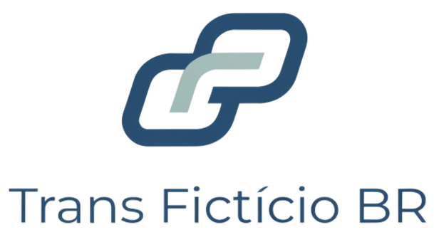

<a id="topo"></a>

<p align="center">
  
</p>

# Logística OTIF · Ciência de Dados & MLOps ponta a ponta

<!-- nav:start -->
 [Sala de Resultados](#sala-de-resultados) | [Problema](#o-problema-de-negócio) | [Acesso aos dados](#sobre-o-cenário-de-acesso-aos-dados) | [Dados](#os-dados) | [Arquitetura](#arquitetura--stack) | [Estrutura](#estrutura-do-repositório) | [Documentação](#documentação) | [Como rodar](#como-rodar) | [Status](#status-do-projeto) | [Autor](#autor)
<!-- nav:end -->

<h2 align="center" id="sala-de-resultados">
  <a href="https://tiago466.github.io/logistica-otif-mlops/">🔎 Abrir a Sala de Resultados</a>
</h2>

<p align="center">
  <b>O produto antes do código.</b><br>
  Os relatórios que o cliente recebe, publicados como site: uma
  <b>Apresentação Executiva</b>, para quem decide, e uma <b>Apresentação Técnica</b>,
  para quem verifica.<br>
  Todo número dos dois é lido das camadas de dados na hora da geração, nunca digitado.
</p>

> Projeto **end-to-end** de Ciência de Dados e MLOps no domínio **logístico**, com dados **100% sintéticos**. Duas entregas sobre a mesma base: **(1)** previsão de **atraso em entregas (OTIF)**, um problema de classificação desbalanceada com custo assimétrico, e **(2)** **raio-x de margem de contribuição por cliente** (Data Discovery financeiro). O foco é a **engenharia** em volta da ciência: pipeline reprodutível, rastreamento de experimentos, testes, CI e monitoramento, não só um notebook com um bom AUC.

> ⚠️ **Aviso sobre a empresa retratada.** A **Trans Fictício BR (TFB)** é uma
> empresa **inteiramente fictícia**, criada para este portfólio, e **todos os
> dados são sintéticos**, gerados por código a partir de uma semente fixa.
> Clientes, transportadores, endereços, valores, indicadores e o enredo de
> negócio (incluindo dificuldades operacionais e financeiras) foram inventados
> para exercitar o método. **Qualquer semelhança com empresas reais, inclusive
> homônimas ou de nome parecido, é mera coincidência, e não existe qualquer
> afiliação, parceria ou relação com elas.** Nenhum dado de cliente real é
> usado, versionado ou publicado neste repositório.
>
> O nome fictício adotado no início do desenvolvimento foi trocado ao
> constatarmos que coincidia com o de uma empresa real do mesmo setor. A troca
> foi feita por precaução e sem qualquer relação com aquela empresa; o nome
> anterior permanece no histórico de commits apenas porque este projeto é
> construído em público, com cada passo registrado.

## O problema de negócio

Uma transportadora fictícia, a **Trans Fictício BR**, tem duas dores clássicas do setor:

1. **Atrasos de entrega corroem o nível de serviço (OTIF: _On Time, In Full_).** Prever, no momento certo, quais pedidos têm alto risco de atrasar permite agir antes (priorizar, realocar, avisar o cliente). É a mesma classe de problema de _churn_: evento raro, custo de errar assimétrico (deixar passar um atraso dói mais que um falso alarme).
2. **Falta visão da margem por cliente.** A empresa fatura frete e armazenagem, e paga custos operacionais (pernas de transporte, bases parceiras, galpão). Quais clientes sustentam a operação, e quais são sustentados por ela? Um diagnóstico de **margem de contribuição** (receita × custo operacional × impostos) revela o que o dia a dia não enxerga.

## Sobre o cenário de acesso aos dados

Este projeto parte de uma condição favorável e **deliberada**: o cliente concedeu acesso de leitura ao banco relacional da operação e aos endpoints da API do sistema financeiro. Foi isso que permitiu reproduzir os relatórios de referência, escolher com precisão as tabelas necessárias e carregar o Bronze diretamente das fontes.

**Na prática, esse não é o cenário mais comum.** Dependendo do porte da empresa, da maturidade da TI e da política de segurança, o que se recebe costuma ser bem diferente:

| O que o cliente entrega | O que muda no projeto |
|---|---|
| Acesso ao banco e à API (este projeto) | consultas sob medida, contrato de ingestão preciso, recarga a qualquer momento |
| Um extrato em CSV ou Excel | trabalha-se com o recorte que veio; qualquer coluna a mais exige novo pedido e nova espera |
| Uma tabela única consolidada, com carga diária | o relacionamento entre entidades já vem resolvido por outra pessoa, e as decisões dela ficam invisíveis |
| Um dump ou área de staging isolada | acesso amplo, porém sem contexto do sistema de origem |

**O que não muda:** as etapas do método. Conectar na fonte, copiar para o Bronze sem transformar, diagnosticar a qualidade, tratar no Silver e só então analisar. Muda o **conector** e o **grau de liberdade** para pedir mais dado, não o rito.

Por isso a camada de conectores existe desde o primeiro commit: trocar um banco por um CSV é trocar o adaptador, não reescrever o pipeline. E é por isso também que a fonte é sempre tratada como **somente leitura**: em boa parte dos casos reais não se tem permissão de escrita, e mesmo quando se tem, alterar a origem é o caminho mais curto para perder a reprodutibilidade e a confiança do cliente.

## Os dados

- **Sintéticos e determinísticos.** Uma empresa fictícia (**Trans Fictício BR**), com dados gerados por semente fixa cobrindo **vários anos** (histórico com sazonalidade e um período de _drift_ proposital, para o monitor detectar). **Nenhum dado real de cliente** é usado ou versionado; a modelagem apenas se inspira na *estrutura* típica do domínio.
- **Imperfeitos de propósito.** Dado real vem sujo, então o gerador planta imperfeições realistas (nulos, duplicatas, chaves órfãs entre sistemas, itens sem valor fiscal). O bronze recebe tudo cru; o tratamento **bronze → silver** corrige com regras explícitas e testadas, guiado por EDA de qualidade.
- **Reprodutível:** quem clona o repositório e preenche o `.env` regenera a base do zero, sem depender de arquivos externos.

## Arquitetura & stack

Fluxo de dados em camadas (**medallion**): fonte → **bronze** (cru) → **silver** (limpo/conformado) → **gold** (pronto para análise e modelo) → **modelo** → **operação** (API + monitoramento).

### Onde cada consumidor busca o dado

O sistema transacional do cliente **nunca** é consultado por relatório ou painel. Ele responde à operação em tempo real, e uma consulta analítica pesada ali compete com quem está trabalhando. O caminho é outro:

```
sistema do cliente  ──(leitura, na janela combinada)──>  bronze → silver → gold
                                                                            │
                                          publicação do modelo dimensional  │
                                                                            v
                                                          banco analítico (Neon)
                                                                            │
                                                    BI, dashboards, consultas ad hoc
```

A camada gold existe **em dois lugares, de propósito**: em Parquet dentro do projeto, que é a verdade reprodutível usada pelo modelo e pelos notebooks; e publicada no banco analítico, que é a vitrine otimizada para quem consulta em SQL. Não é duplicação por descuido, é **serving layer**.

**Portabilidade.** Trocar o banco analítico (Neon por RDS, Azure SQL, BigQuery) é trocar variável de ambiente, não reescrever o pipeline. Isso só se sustenta por uma disciplina: **a lógica de negócio vive no pipeline, em Python, e o banco recebe o resultado pronto**. Transformação escrita em SQL amarra o projeto ao dialeto daquele banco, e a portabilidade evapora na primeira migração.

| Camada | Tecnologia | Papel |
|---|---|---|
| Ingestão | **Conectores** (ports & adapters) | toda fonte (banco/arquivo/API) entra por um conector nomeado, configurado por ambiente |
| Armazenamento | **PostgreSQL** (dev) / **Neon** (nuvem) | base relacional sintética + camadas gold |
| Processamento | **Python 3.12**, **pandas** | pipelines medallion |
| Modelagem | **scikit-learn** (+ XGBoost/LightGBM) | baseline honesto, depois comparação de candidatos; modelo final escolhido por **validação temporal e custo**, calibrado, com threshold por custo |
| Experimentos | **MLflow** | tracking + registry de modelos |
| Qualidade | **ruff · mypy · pytest** + **CI** | esteira automatizada a cada mudança |
| Monitoramento | detecção de **drift** | vigia a distribuição dos dados em produção |
| GenAI | **RAG + agente** | consulta em linguagem natural sobre métricas validadas |
| Deploy | **Render** | API de predição e relatórios |

## Estrutura do repositório

```
logistica-otif-mlops/
├── src/logistica_otif_mlops/    # o pacote instalável
│   ├── config.py                # configuração 12-factor (via ambiente)
│   ├── connectors/              # camada de conectores de dados (base + registro)
│   ├── api_custos/              # a API do sistema financeiro (a segunda fonte)
│   ├── pipelines/               # bronze (ingestão) e silver (tratamento)
│   ├── relatorios/              # gera os relatórios do cliente (HTML + PDF)
│   ├── seed/                    # geração e publicação da base sintética
│   └── dicionario.py            # gera o dicionário de dados a partir do banco
├── app/                         # a Sala de Resultados (FastAPI + Jinja2 + HTMX)
├── reports/                     # relatórios publicados + extratos que o app consome
├── scripts/                     # utilitários de manutenção do projeto
├── assets/                      # identidade visual (logos)
├── infra/                       # o ambiente do CLIENTE (containers das fontes)
├── sql/                         # relatórios de referência reproduzidos
├── notebooks/                   # exploração, por domínio (operacional/financeiro)
├── data/                        # camadas medallion (não versionadas)
├── migrations/                  # evolução do schema (Alembic)
├── tests/                       # testes automatizados
├── docs/                        # documentação (CRISP-DM)
├── docker-compose.yml           # sobe as duas fontes (banco + API)
├── render.yaml                  # blueprint de deploy da API
├── .env.example                 # modelo de configuração (sem segredos)
└── pyproject.toml               # projeto e dependências (uv)
```

## As duas fontes

O projeto conversa com **dois sistemas diferentes**, de propósito, porque é assim na empresa real:

| Fonte | Conteúdo | Acesso |
|---|---|---|
| Banco relacional (sistema operacional) | pedidos, fases, entregas, estoque, cadastro | SQL |
| API do sistema financeiro (de terceiro) | faturamento, custos, parâmetros, tarifas | HTTP com chave |

Um pipeline que assume "está tudo num banco só" quebra no primeiro cliente de verdade. Por isso as duas entram por **conectores** intercambiáveis: quem consome pede um DataFrame e não precisa saber de onde veio.

As duas rodam em **containers separados**, como estariam em servidores diferentes na empresa. O projeto roda fora deles e as conhece só pelo `.env`:

```bash
docker compose up -d    # sobe o ambiente do cliente: banco + API financeira
```

## Documentação

- **[CRISP-DM · hub da documentação](docs/README.md)**, o roteiro do projeto de dados, etapa por etapa
- **[Acesso aos dados](docs/03_acesso_aos_dados.md)**: conectar no banco (DBeaver) e na API (Power BI, Python)
- **[Dicionário de dados](docs/04_dicionario_de_dados.md)**: as 30 tabelas, coluna a coluna (gerado do banco)

## Como rodar

Pré-requisitos: **Python 3.12** e **[uv](https://docs.astral.sh/uv/)**.

> **Ambiente-base: Linux.** O projeto roda em Linux. No **Windows 11 (ou posterior)**, clone e instale normalmente, mas execute **dentro do WSL 2 + Ubuntu** (o comando `wsl --install` prepara tudo). Todos os comandos abaixo assumem um terminal Linux.

```bash
git clone git@github.com:tiago466/logistica-otif-mlops.git
cd logistica-otif-mlops
uv sync                 # cria o ambiente e instala as dependências
cp .env.example .env    # configure as variáveis (sem segredos no git)
uv run pytest           # roda os testes
```

Com o banco de pé (`docker compose up -d`), o caminho completo do dado até o relatório:

```bash
uv run python -m logistica_otif_mlops.pipelines.bronze      # ingestão (cópia fiel)
uv run python -m logistica_otif_mlops.pipelines.silver      # tratamento (mesmo grão)
uv run python -m logistica_otif_mlops.relatorios            # Sala de Resultados (HTML)
uv run python -m logistica_otif_mlops.relatorios.pdf        # os dois relatórios em PDF
uv run python -m logistica_otif_mlops.relatorios.extratos   # extratos que a apresentação lê
uv run uvicorn app.main:app --reload                        # a Sala de Resultados
```

## Status do projeto

Construído em público, um passo por vez. Transparência sobre o que já está de pé:

- [x] Esqueleto do pacote + camada de conectores + configuração 12-factor
- [x] Modelagem do domínio (MER, 30 tabelas em duas fontes) + dicionário de dados
- [x] Base relacional sintética de 11 anos, validada contra 21 indicadores de referência
- [x] Publicação em nuvem + API do sistema financeiro (chave, paginação, menor privilégio)
- [x] Relatórios de referência reproduzidos e aprovados pelos donos
- [x] Pipeline medallion: bronze (ingestão) e silver (tratamento, com auditoria)
- [x] EDA de qualidade + validação do Silver + Sala de Resultados (executivo e técnico)
- [ ] Camada gold (transformações de negócio)
- [ ] Data Discovery financeiro: margem de contribuição por cliente (relatório executivo + slides)
- [ ] Modelo de predição OTIF (baseline + comparação) + MLflow
- [ ] Testes, CI e monitoramento de drift
- [ ] Camada GenAI (RAG + agente) + deploy

## Autor

<a id="autor"></a>

**Tiago Lima** · Cientista de Dados (foco em MLOps e automação com IA).

**LinkedIn:** https://www.linkedin.com/in/tiago-lima-935049154/<br>
**GitHub:** https://github.com/tiago466<br>
**E-mail:** tiago.p.limm@gmail.com

---

[Início](#topo)
