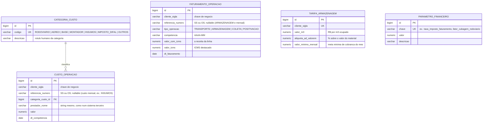

<a id="topo"></a>

# Entendimento dos Dados · TransBrasil (CRISP-DM · Etapa 2)

<!-- nav:start -->
[← Índice CRISP-DM](README.md) | [« Entendimento do Negócio](01_entendimento_do_negocio.md)
<!-- nav:end -->

> A segunda etapa do CRISP-DM: **onde os dados moram, como são servidos e qual é o seu modelo**. Aqui vive o MER (Modelo Entidade-Relacionamento) dos dois sistemas da TransBrasil. O Mermaid versionado neste arquivo é a **fonte da verdade** do desenho; o físico (models/migrations) deriva dele. Dados 100% sintéticos.

## 1. Os dois sistemas (e as duas formas de acesso)

A TransBrasil, como toda empresa real, não tem "um banco": tem **sistemas**. O João (TI) nos dá acesso a dois:

| Sistema | Conteúdo | Como é servido | Schema |
|---|---|---|---|
| **Operacional (WMS/TMS)** | pedidos, fases, minutas, entregas, bases, estoque, recebimentos, ocorrências, cadastros | acesso direto ao **PostgreSQL** (Neon) | `operacao` |
| **Financeiro (terceiro)** | faturamento e custos por operação, tarifas de armazenagem | **API REST** com chave (`X-API-Key`) | `custos` (interno da API) |

> **Detalhe de realismo:** o sistema financeiro **não tem chave estrangeira** para o operacional. A ligação entre eles é por **chave de negócio** (`numero` do pedido, sigla da organização), como acontece entre sistemas de fornecedores diferentes. Quem casa as fontes somos nós, no pipeline.

## 2. A malha física: Matriz, galpões e Bases

A TransBrasil opera a partir da **Matriz** (Santa Catarina), cujo estoque se distribui em **galpões internos** (locais de estoque, ex.: TB1, G2). Para alcançar o país, mantém **Bases regionais**: prestadoras de serviço parceiras que funcionam como ponto avançado (recebem, estocam e entregam). Dentro de cada galpão, o WMS endereça fisicamente cada item no padrão **`ÁREA.RUA.NÍVEL.POSIÇÃO`** (ex.: `TB1.T.36.1`); esse endereçamento fino é conceito do domínio documentado aqui, mas fica **fora do modelo v1** (uma posição abriga vários SKUs, exigiria tabelas próprias de WMS sem ganho para OTIF/MC). Um pedido pode ser atendido de três formas (campo `tipo_atendimento`, definido no planejamento):

| Tipo | Fluxo | O prazo (OTIF) é medido em |
|---|---|---|
| `ENTREGA_DIRETA` | Matriz → endereço do destino final | chegada ao endereço |
| `RETIRA_BASE` | Matriz → Base; o cliente retira lá | **chegada à Base** (a demora do cliente em retirar não é atraso nosso) |
| `ENTREGA_VIA_BASE` | Matriz → Base → endereço (última milha da Base) | chegada ao endereço final |

## 3. MER · sistema Operacional (schema `operacao`)

Vinte e cinco entidades em três grupos. O desenho segue o **padrão Party**: clientes, bases e a própria matriz são **`ORGANIZACAO`** (mesmos atributos, papéis diferentes via `tipo_parceria`); endereços pertencem a organizações; locais físicos de estoque são **`LOCAL_ESTOQUE`**. Além do fluxo de distribuição (o pedido), a operação presta dois serviços paralelos: **coleta reversa** (`COLETA`) e **montagem em eventos** (`POSITIVACAO`).

```mermaid
erDiagram
    %% ============ CADASTRO ============
    ORGANIZACAO {
        bigint id PK
        varchar sigla UK "ex.: DHC, WCH, TBR"
        varchar razao_social
        varchar nome_fantasia "ex.: DermaHealth Cosmeticos"
        varchar cnpj UK
        varchar tipo_parceria "CLIENTE | BASE | MATRIZ"
        varchar porte "nullable; MICRO..MEGA (so cliente)"
        varchar segmento "cosmeticos, alimenticio...; LOGISTICA p/ base"
        boolean fl_entrega_agendada "nullable; regra de cliente"
        date dt_inicio_contrato
        date dt_cancelamento "nullable; onda de cancelamentos em 2025"
        boolean ativo
    }
    ENDERECO {
        bigint id PK
        bigint organizacao_id FK "dono do ponto (cliente, base ou matriz)"
        varchar nome_local "identidade do ponto: Consultorio X, Expo Center..."
        varchar documento "nullable; CNPJ/CPF contra quem a NF e emitida"
        varchar logradouro
        varchar bairro
        varchar cidade
        varchar uf "regiao e derivada da UF"
        varchar cep
        numeric latitude
        numeric longitude
        boolean fl_principal
    }
    ITEM {
        bigint id PK
        bigint cliente_id FK "organizacao CLIENTE dona do catalogo"
        varchar codigo
        varchar descricao
        varchar grupo "ex.: MATERIAL PROMOCIONAL"
        varchar subgrupo "ex.: BANNER, AMOSTRA, PANFLETO"
        numeric peso_kg
        numeric volume_m3
        numeric valor_unitario "nullable; item SEM valor = furo de cobertura fiscal"
        boolean ativo
    }
    LOCAL_ESTOQUE {
        bigint id PK
        bigint organizacao_id FK "dona: MATRIZ ou BASE"
        varchar codigo UK "identidade curta do galpao: TB1, G2, BSE..."
        varchar nome "Galpao 1..4 da matriz; deposito da base"
        boolean ativo
    }
    TRANSPORTADOR {
        bigint id PK
        varchar nome
        varchar cnpj
        varchar tipo "FROTA_PROPRIA | AGREGADO | CARRETEIRO | TRANSPORTADORA"
        boolean ativo
    }
    VEICULO {
        bigint id PK
        bigint transportador_id FK
        varchar placa UK
        varchar tipo_veiculo "van, truck, carreta..."
        numeric capacidade_kg
    }
    ROTA {
        bigint id PK
        varchar codigo UK
        varchar descricao
        varchar uf
    }

    %% ============ CONFIGURACAO (reguas) ============
    MODALIDADE {
        bigint id PK
        varchar codigo UK "RODOVIARIO | AEREO"
        varchar descricao "rotulo humano: Rodoviário, Aéreo"
        boolean ativo
    }
    LEAD_TIME {
        bigint id PK
        bigint modalidade_id FK
        varchar uf
        varchar cidade
        int dias_uteis "regua consultada na criacao; resultado carimba o pedido"
    }
    SLA_FASE {
        bigint id PK
        bigint fase_id FK "UK; regua INTERNA da etapa"
        int horas_uteis_meta
        int horas_uteis_limite "dias derivam na exibicao (horas / 8)"
    }
    CAMPANHA {
        bigint id PK
        varchar descricao "ex.: Black Friday 2024"
        date dt_inicio
        date dt_fim
    }
    FASE {
        bigint id PK
        varchar codigo UK "EA PC DC PL EX CF ME EN EC CE"
        varchar nome
        int ordem
        boolean fl_esporadica "DC e EX"
    }
    TIPO_OCORRENCIA {
        bigint id PK
        varchar codigo UK
        varchar descricao "reentrega, devolucao, avaria..."
        boolean fl_impacta_prazo
    }

    %% ============ MOVIMENTO ============
    PEDIDO {
        bigint id PK
        varchar numero UK "a SS; chave de NEGOCIO (formato, sem aritmetica)"
        bigint cliente_id FK "organizacao CLIENTE solicitante"
        bigint endereco_id FK "destino FINAL do pedido"
        bigint modalidade_id FK
        bigint campanha_id FK "nullable"
        varchar canal "GRADE | WEB"
        varchar nivel_servico "PADRAO | EXCLUSIVO (veiculo dedicado imediato, preco 3x)"
        varchar tipo_atendimento "ENTREGA_DIRETA | RETIRA_BASE | ENTREGA_VIA_BASE; definido no PL"
        timestamp dt_solicitacao
        date dt_prazo_saida_expedicao "prazo interno de expedicao"
        date dt_prazo_entrega "prazo prometido ao cliente"
        numeric peso_teorico_kg
        numeric volume_teorico_m3
        numeric peso_real_kg "nullable; medido no manuseio (ME)"
        numeric volume_real_m3 "nullable"
        varchar nf_numero "nullable; nasce na fase EN"
    }
    PEDIDO_ITEM {
        bigint id PK
        bigint pedido_id FK
        bigint item_id FK
        int quantidade
    }
    PEDIDO_FASE {
        bigint id PK
        bigint pedido_id FK
        bigint fase_id FK
        timestamp dt_entrada
        timestamp dt_saida "nullable; linha aberta = fase atual"
    }
    ORDEM_COLETA {
        bigint id PK
        bigint pedido_id FK
        bigint local_estoque_id FK "um DOC por local onde ha itens do pedido"
        timestamp dt_emissao
        timestamp dt_conclusao "nullable"
        varchar status "EMITIDA | COLETADA | CANCELADA"
    }
    MINUTA {
        bigint id PK
        varchar numero UK "o embarque/romaneio"
        bigint modalidade_id FK "modal DESTA perna (pedido pode ser multimodal)"
        bigint transportador_id FK "quem executa a viagem"
        bigint veiculo_id FK "nullable no aereo"
        bigint rota_id FK
        varchar tipo_carga "CONSOLIDADA | EXCLUSIVA (dimensao do pivot da Sarah)"
        timestamp dt_expedicao
    }
    ENTREGA {
        bigint id PK
        bigint pedido_id FK
        bigint minuta_id FK "em qual embarque esta perna viajou"
        varchar tipo_perna "DIRETA | TRANSFERENCIA_BASE | ULTIMA_MILHA_BASE"
        bigint endereco_destino_id FK "destino DESTA perna (base ou destino final)"
        date dt_prevista
        timestamp dt_chegada "nullable; chegada real"
        timestamp dt_entrada_base "nullable; quando a BASE efetiva a entrada (disponivel p/ retirada ou ultima milha)"
        varchar recebedor "nullable; quem assinou"
        boolean fl_sucesso
        boolean fl_canhoto
    }
    RETIRADA_BASE {
        bigint id PK
        bigint pedido_id FK "0..1 por pedido (tipo RETIRA_BASE)"
        bigint base_id FK "organizacao BASE onde retirou"
        timestamp dt_retirada
        varchar retirado_por
    }
    OCORRENCIA {
        bigint id PK
        bigint pedido_id FK
        bigint entrega_id FK "nullable"
        bigint tipo_ocorrencia_id FK
        timestamp dt_ocorrencia
        varchar observacao
        timestamp dt_cancelada "nullable; cancelamento logico"
    }
    RECEBIMENTO {
        bigint id PK
        bigint item_id FK "cliente deriva do item"
        bigint local_estoque_id FK "onde o material entrou"
        varchar numero_agendamento "nullable; agenda de entrada"
        varchar fornecedor_nome "nullable; quem entrega (grafica do cliente etc.)"
        varchar nf_entrada
        int quantidade
        date dt_validade "nullable; lote perecivel - alimenta estoque vencido"
        date dt_prevista
        timestamp dt_recebimento "nullable; chegada real do material"
        varchar status "AGUARDANDO | RECEBIDO | DIVERGENTE"
    }
    ESTOQUE_SNAPSHOT {
        bigint id PK
        date data "fechamento mensal (historico) + diaria no mes corrente"
        bigint item_id FK "cliente deriva do item"
        bigint local_estoque_id FK
        int qtde_saldo
        numeric m3_ocupado
        numeric valor_material "valor estocado do item, congelado na epoca da foto"
        numeric valor_danificado "parcela em material danificado"
    }
    COLETA {
        bigint id PK
        varchar numero UK "a OS de coleta; chave de negocio p/ o financeiro"
        bigint cliente_id FK
        bigint endereco_origem_id FK "onde buscar (ponto do cliente)"
        bigint local_estoque_destino_id FK "para onde o material vem"
        bigint transportador_id FK
        bigint veiculo_id FK "nullable"
        timestamp dt_solicitacao
        date dt_prevista
        timestamp dt_coleta "nullable; execucao real"
        numeric peso_kg
        numeric volume_m3
        varchar finalidade "DESCARTE | RETORNO_ESTOQUE; descarte nao volta ao estoque vendavel"
        varchar status "SOLICITADA | COLETADA | CANCELADA"
    }
    POSITIVACAO {
        bigint id PK
        varchar numero UK "a OS de servico; chave de negocio p/ o financeiro"
        bigint cliente_id FK
        bigint pedido_id FK "nullable; pedido de referencia (material enviado ao evento)"
        bigint endereco_id FK "local do evento"
        bigint campanha_id FK "nullable"
        varchar parceiro_nome "montador parceiro local"
        date dt_abertura
        date dt_servico "nullable"
        varchar status "ABERTA | REALIZADA | CANCELADA"
    }

    %% ============ RELACOES ============
    ORGANIZACAO ||--o{ ENDERECO : "possui pontos"
    ORGANIZACAO ||--o{ ITEM : "cataloga (cliente)"
    ORGANIZACAO ||--o{ PEDIDO : "solicita (cliente)"
    ORGANIZACAO ||--o{ LOCAL_ESTOQUE : "opera (matriz/base)"
    ORGANIZACAO ||--o{ RETIRADA_BASE : "local de retirada (base)"
    ITEM ||--o{ ESTOQUE_SNAPSHOT : "guarda historico"
    ENDERECO ||--o{ PEDIDO : "destino final de"
    ENDERECO ||--o{ ENTREGA : "destino da perna"
    MODALIDADE ||--o{ PEDIDO : "define prazo"
    MODALIDADE ||--o{ MINUTA : "modal do embarque"
    MODALIDADE ||--o{ LEAD_TIME : "parametriza"
    CAMPANHA |o--o{ PEDIDO : "origina"
    PEDIDO ||--|{ PEDIDO_ITEM : "contem"
    ITEM ||--o{ PEDIDO_ITEM : "aparece em"
    ITEM ||--o{ RECEBIMENTO : "entra via"
    PEDIDO ||--|{ PEDIDO_FASE : "percorre"
    FASE ||--o{ PEDIDO_FASE : "classifica"
    FASE ||--o| SLA_FASE : "regua interna"
    PEDIDO ||--o{ ORDEM_COLETA : "separa em DOCs"
    LOCAL_ESTOQUE ||--o{ ORDEM_COLETA : "coleta em"
    LOCAL_ESTOQUE ||--o{ RECEBIMENTO : "recebe em"
    LOCAL_ESTOQUE ||--o{ ESTOQUE_SNAPSHOT : "fotografado"
    PEDIDO ||--o{ ENTREGA : "pernas e tentativas"
    MINUTA ||--o{ ENTREGA : "consolida"
    TRANSPORTADOR ||--o{ VEICULO : "opera"
    TRANSPORTADOR ||--o{ MINUTA : "executa"
    VEICULO |o--o{ MINUTA : "usado em"
    ROTA ||--o{ MINUTA : "agrupa"
    PEDIDO |o--o| RETIRADA_BASE : "retirado na base"
    PEDIDO ||--o{ OCORRENCIA : "registra"
    ENTREGA |o--o{ OCORRENCIA : "associada a"
    TIPO_OCORRENCIA ||--o{ OCORRENCIA : "tipifica"
    ORGANIZACAO ||--o{ COLETA : "solicita (cliente)"
    ENDERECO ||--o{ COLETA : "origem da coleta"
    LOCAL_ESTOQUE ||--o{ COLETA : "destino da coleta"
    TRANSPORTADOR ||--o{ COLETA : "executa"
    ORGANIZACAO ||--o{ POSITIVACAO : "contrata (cliente)"
    PEDIDO |o--o{ POSITIVACAO : "material de referencia"
    ENDERECO ||--o{ POSITIVACAO : "local do evento"
```



## 4. MER · sistema Financeiro (schema `custos`, atrás da API)

O financeiro enxerga o mundo por **operações** e **competências**, ligado ao operacional só por chave de negócio (`referencia_numero` = a SS do pedido ou a OS de coleta/positivação). É daqui que a Dna. Sarah monta o relatório mensal de **Margem de Contribuição**: `MC = receita - (custo variável + impostos)`, onde impostos = imposto sobre faturamento (taxa parametrizada) + ICMS. O imposto percentual **não se armazena**: os parâmetros vivem em `PARAMETRO_FINANCEIRO` (o espelho da aba PARAMETROS do relatório real) e aplicam-se na análise. Os **tipos de operação cobrem o universo do relatório da Sarah**: TRANSPORTE, ARMAZENAGEM, COLETA e POSITIVACAO geram receita; DIFAL e INSUMOS entram como categorias de custo.



## 5. A vida de um pedido: o fluxo, as pessoas e o dado que nasce

O modelo da Seção 3 é a **sombra do processo**. Se alguma cena ficasse sem tabela, o MER estaria furado; se alguma tabela não aparecesse em cena nenhuma, ela seria gordura.

| Cena | Quem atua | O que acontece | Dado que nasce |
|---|---|---|---|
| Contrato e cadastro | Comercial (Sr. Abraão) · TI (João) | organizações entram na carteira; catálogo e pontos de entrega cadastrados | `ORGANIZACAO`, `ITEM`, `ENDERECO`, `LOCAL_ESTOQUE` |
| Material chega | fornecedor do cliente → galpão (Joel) ou Base | remessa entra no estoque (agendamento, prazo e SLA próprios) | `RECEBIMENTO`; estoque refletido em `ESTOQUE_SNAPSHOT` (fechamento mensal + mês corrente) |
| Entrada do pedido | o cliente (grade ou web) | pedido criado; prazo prometido pela régua | `PEDIDO` (canal, `dt_prazo_entrega` via `LEAD_TIME`), `PEDIDO_ITEM`, vínculo com `CAMPANHA` |
| EA · Em Aprovação | hierarquia do cliente | validação hierárquica | `PEDIDO_FASE` (EA) |
| PC · Pré-Conferência | equipe do Samuel | confere produtos, quantidades, endereço | `PEDIDO_FASE` (PC); erro vira `OCORRENCIA` |
| DC · Cotas (esporádica) | Samuel | controle por canal (grade); subsistema fora da v1 | `PEDIDO_FASE` (DC) |
| **PL · Planejamento** | Samuel + Joel | janela de produção, rota e forma de atendimento definidas | `PEDIDO_FASE` (PL); `tipo_atendimento` · **momento da previsão do modelo** |
| EX · Em Análise (esporádica) | Samuel | urgências extremas (D+2) | `PEDIDO_FASE` (EX) |
| CF · Coleta Física | Joel | itens localizados; **uma ordem de coleta por local** (a DOC) | `PEDIDO_FASE` (CF); **`ORDEM_COLETA`** (qtde de DOCs ↑ = risco ↑) |
| ME · Manuseio | equipe do Joel | etiquetagem, pesagem, embalagem | `PEDIDO_FASE` (ME); `peso_real_kg`, `volume_real_m3` |
| EN · Emissão | fiscal/adm | NF-e emitida contra o destinatário do ponto | `PEDIDO_FASE` (EN); `nf_numero` |
| EC · Expedição | Joel + transportador | pedidos **consolidados num embarque**; caminhão sai | `PEDIDO_FASE` (EC); **`MINUTA`** + `ENTREGA` (pernas DIRETA/TRANSFERENCIA_BASE) |
| CE · Confirmação de Entrega | motorista, Base ou recebedor | chegada confirmada (ou não); via Base: última milha ou retirada | `ENTREGA` (`dt_chegada`, `fl_sucesso`, `recebedor`); `RETIRADA_BASE`; falha vira `OCORRENCIA` + nova `ENTREGA` |
| Fluxo paralelo: coleta reversa | cliente → Joel + transportador | material do cliente é buscado num ponto e trazido ao estoque (OS própria) | `COLETA`; receita/custo tipo COLETA no financeiro |
| Fluxo paralelo: positivação | cliente → montador parceiro | material enviado a um evento é montado no local por parceiro pago pela TransBrasil | `POSITIVACAO`; receita tipo POSITIVACAO + custo MONTADOR |
| Pós-fluxo financeiro | Dna. Sarah · sistema terceiro | prestadores cobram; TransBrasil fatura frete, armazenagem e serviços; impostos (DIFAL) e insumos lançados | `CUSTO_OPERACAO`, `FATURAMENTO_OPERACAO`, `TARIFA_ARMAZENAGEM`, `PARAMETRO_FINANCEIRO` |

O **Sr. Abraão** e o **Sr. Elias** não escrevem dado nenhum: consomem indicadores. O modo de emergência do Elias (rodoviário → aéreo) imprime custo `AEREO` em pedido rodoviário, padrão que o raio-x da Dna. Sarah deve reencontrar.

## 6. Decisões de modelagem (e o porquê)

1. **Padrão Party (`ORGANIZACAO`).** Clientes, bases e matriz compartilham atributos e diferem no papel (`tipo_parceria`). Decisão do Tiago, referências: Fowler (*Analysis Patterns*, cap. 2), Hay (*Data Model Patterns*). A entidade `DESTINATARIO` foi absorvida: a identidade de quem recebe vive no ponto (`ENDERECO.nome_local`/`documento`, contra quem a NF é emitida); quem **assinou** cada entrega segue na `ENTREGA.recebedor`.
2. **`LOCAL_ESTOQUE` em vez de "filial".** Os galpões G1..G4 são locais físicos da Matriz (não pessoas jurídicas, mono-empresa preservada); cada Base tem seu depósito. É o alicerce da DOC e do estoque.
3. **`MINUTA` modela a consolidação.** Vários pedidos (e pernas) viajam no mesmo embarque; transportador, veículo e rota são do embarque, não da entrega. Resolve o aéreo (minuta sem veículo) e expõe um driver real de atraso: prazos heterogêneos dentro da mesma minuta (futura *feature*: dispersão de prazos). **O "modalidade-baú" do sistema de referência foi desmontado em eixos ortogonais**: meio físico (`MODALIDADE`), nível de serviço (`PEDIDO.nivel_servico` PADRAO|EXCLUSIVO, contratado na criação, preço 3×), forma de atendimento (`tipo_atendimento`), tipo de carga do embarque (`MINUTA.tipo_carga`) e tipo de veículo (`VEICULO`). Consistência pedido-EXCLUSIVO ⇒ minuta-EXCLUSIVA é teste de qualidade no silver.
4. **`ORDEM_COLETA` (DOC).** Itens de um pedido espalhados em N locais geram N ordens de coleta; volume de DOCs por pedido é sinal preditivo de atraso (achado real do domínio). A *feature* leak-free equivalente no PL: "em quantos locais os itens estão alocados".
5. **Histórico de fases em formato longo (`PEDIDO_FASE`).** Cada passagem é um evento; a versão larga é derivação silver. Fases esporádicas (DC, EX) cabem sem mudança.
6. **`ENTREGA` = perna × tentativa; alvo por `tipo_atendimento`.** DIRETA/VIA_BASE medem na chegada ao destino final; RETIRA_BASE mede na **chegada à Base** (demora do cliente em retirar vira *aging*, não atraso). Nenhum `fl_atraso` armazenado: **derivado se calcula** (mesma razão de não existir `fase_atual_id`, decisão do Tiago). **Atribuição de responsabilidade na Base:** chegar à Base e a Base **efetivar a entrada** são fatos distintos (`dt_chegada` × `dt_entrada_base`); o atraso entre eles é **da Base** (indicador derivado que fundamenta repasse de multa ao parceiro e mede a performance de cada base).
7. **Chave técnica × chave de negócio.** `id` é interno e não sai; `numero` (SS) e `sigla` viajam para outros sistemas. Chave de negócio é `varchar`: aceita formato, zero à esquerda e nunca sofre aritmética.
8. **Sem FK entre sistemas.** O financeiro referencia por chave de negócio; reconciliação vira teste de qualidade no silver.
9. **Região não é coluna: deriva da UF.** `LEAD_TIME` é **tabela-régua** (parametrização por modalidade × UF × cidade), consultada na criação e carimbada no pedido. **`SLA_FASE`** (2026-07-30, pedido do Tiago) é a régua **interna** irmã: horas úteis meta/limite por fase, base da análise de gargalo (real × régua) e insumo do gerador. Dias não se armazenam: derivam na exibição (horas ÷ 8), para o gestor bater o olho sem calcular.
10. **Estoque como foto por item com retenção inteligente** (`data × item × local`, decisão do Tiago): o grão por item mantém o cliente derivável (via `ITEM`) e as análises por item nativas (DSM, vencidos, danificados). O volume é controlado pela **política de retenção**: histórico guarda a **foto de fechamento mensal**; o **mês corrente** tem foto diária. A cobrança de armazenagem usa o fechamento; movimentações finas seguem deriváveis de `RECEBIMENTO` × `PEDIDO_ITEM`.
11. **Financeiro guarda lançamentos, não MC.** A margem é cálculo da análise (o Discovery reconstrói o relatório da Sarah).
12. **KPIs são derivados, não colunas** (% OTIF, DSM, vencidos, danificados, cobertura fiscal, tempos, % ocorrência/reentrega/devolução). Cobrança de armazenagem: `max(m3 × valor_m3 + valor_material × aliquota, valor_minimo_mensal)` por competência.
13. **O financeiro cobre o universo do relatório de MC** (decisão do Tiago: mundo fechado e consistente): COLETA e POSITIVACAO ganharam entidades operacionais **simbólicas e enxutas** (sem fluxo de fases próprio); DIFAL e INSUMOS são só lançamentos de custo com regra. As regras das derivadas (MC, cubagem, DIFAL, cobrança de armazenagem, dev/reentrega) estão catalogadas no cofre interno de regras e migram para a doc pública junto do Discovery.
14. **Convenção de caixa e acento (detectada em revisão do Tiago).** `codigo` = chave estável para máquina: CAIXA_ALTA, sem acento, sem espaço (entra em CHECK, join e código). `nome`/`descricao` = rótulo para humano: português com acento e capitalização normal (vai para tela e relatório). Dados **digitados por usuário** (razões sociais, endereços) não têm caixa forçada no OLTP: o gerador imprime caixa mista de propósito e a **padronização é responsabilidade do silver** (como no mundo real).
15. **Extensões futuras registradas:** subsistema de cotas (DC, incl. `qtd_cota`/`qtd_reservado`), metas comerciais (R$/kg por base), modalidade ESPECIAL, fluxo de fases para coleta/positivação, estoque por lote e classe regulatória (ANVISA), **endereçamento físico de armazém** (posições `ÁREA.RUA.NÍVEL.POSIÇÃO`), documentos por fase.

## 7. Como visualizar o MER (draw.io)

O Mermaid acima é a verdade versionada. Para ver o desenho: abra o [draw.io](https://app.diagrams.net) → novo diagrama em branco → botão **"+" (Inserir)** na barra → **Avançado** → **Mermaid...** → cole o bloco `erDiagram` (sem a cerca ```` ```mermaid ````) → **Inserir**. Repita em outra página para o diagrama de custos.

---

[Início](#topo)
